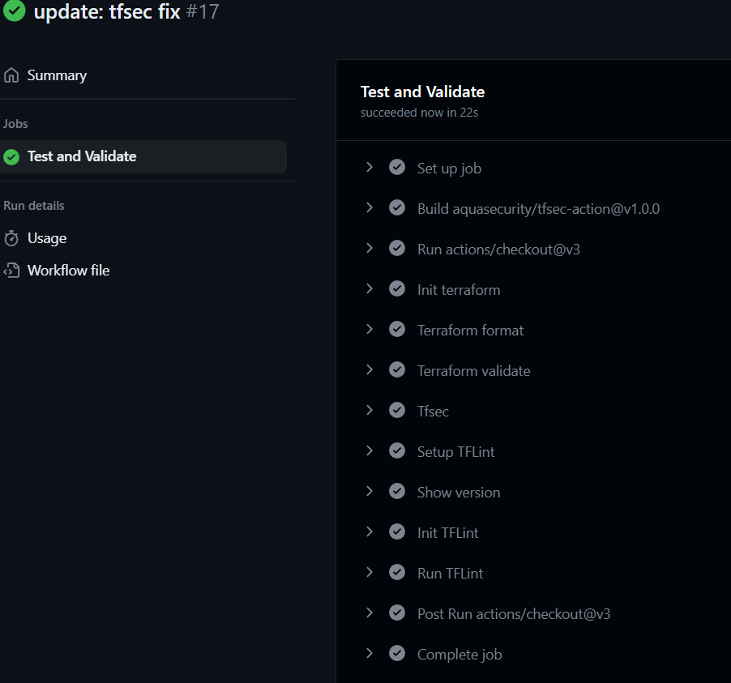

# Infrastructure as Code - Assignment 2
This is the submission of assignment 2 in IIKG3005 - Infrastructure as Code 2023 for Andreas Follevaag Malde. The assignment is to create a simple and easy deployable terraform project that provisions infrastructure on Azure, but where the main focus is on the CI/CD aspect using workflows for automatic testing and deployment, branches and workspaces for different stage environments.

## Overview
- Project structure and module description
- The use of terraform scripts
- Prerequisites/Dependencies
- Images of deployment

## Project structure and module description
The project is structured as follows:
```
.
├── .github
│   └── workflows
│       ├── deployment.yml
|       └── testAndValidate.yml
├── images
|   └── **.png
├── network
│   ├── main.tf
│   └── variables.tf
├── vm
│   ├── main.tf
│   └── variables.tf
├── main.tf
├── providers.tf
├── variables.tf
├── terraform.tfvars
├── .gitignore
└── README.md
```
The project consist of a root folder where the main terraform files are located, this includes a providers.tf file which contains provider information, a main.tf file containing the terraform code for connecting the modules uses in the project and a variables.tf file containing the variables used in the project. The terraform.tfvars file contains example values for the more sensistive variables such at the username and password for the virtual machine. The .gitignore file contains files that should be excluded from verison control.
There are two modules in this project, who are responsible for provisioning the infrastructure resources in Azure. The follwing modules are:
- Network
- VirtualMachine

### Network module
The network module is responsible for provisioning the network resources in Azure. This includes a resource group, a virtual network, a subnet and a network security group. The network security group has one security rule allowing traffic to come from a specific IP on a specific port. The example varaiables open for SSH traffic on port 22 from a NTNU VPN IP address.

### VirtualMachine module
The virtual machine module is responsible for provisioning the virtual machine in Azure. This includes a linux virtual machine, a public IP address and a network interface card to connect the machine to the network. The virtual machine is provisioned with a username and password, and the public IP address is used to connect to the VM from the outside.

## The use of terraform scripts
Terraform scripts used in to provision the infrastructure are as follows:
### Initialize Terraform
To initialize a terraform project this command is used:
```
terraform init
```
### Terraform format
To check if the formatting of the terraform files are correct this command is used:
```
terraform fmt -check -recursive
```
And to fix the formatting of the terraform files this command is used:
```
terraform fmt -recursive
```
This commands should be used from the root folder
### Terraform validate
To check if the terraform files are valid this command is used:
```
terraform validate
```
### Tfsec
To check for security issues in the terraform files this command is used:
```
tfsec --minimum-severity HIGH
```
The minimum severity tells the program to skip warnings that are below HIGH in severity.
### Tflint
To check for errors in the terraform files this command is used:
```
tflint --init && tflint
```
### Terraform plan
To see what terraform will do when it is applied this command is used (this will not deploy the infrastructure):
```
terraform plan -out=main.tfplan
```
### Terraform apply
To apply the infrastructure from the plan file, one can use this command:
```
terraform apply main.tfplan
```
One can also deploy directly without a plan file by using this command:
```
terraform apply -auto-approve
```
### Terraform destroy
To destroy the infrastructure that has been deployed, this command is used:
```
terraform destroy -auto-approve
```
## Prerequisites/Dependencies
To run this project one needs the following prerequisites and dependencies:
- **Terraform** - For provisioning the infrastructure
- **Azure account** - A place to deploy to
- **Azure CLI** - For authenticating with Azure
- **Github account** - For CI/CD (github actions) and version controll of code
- **Terraform providers** - hashicorp/azurerm and hashicorp/random

## Images of deployment
This section will show some images of the deployment of the infrastructure to Azure. The images are taken from the terminal, the Azure portal and github.

### Terraform test and validate workflow
Pushing changes in any terraform file to a branch other than main will result in a terraform test and validate workflow to run. 
#### Terraform fmt fail
The first results from the test shows fail in formatting.

#### Terraform fmt
Running the terraform fmt command fixes the formatting issues.

#### Terraform security test fail - tfsec
Pushing the new changes to the same branch make another testandvalidate workflow run. This time the test fails on security issues.

The message is as follows.

#### Fixing the tfsec fail
To fix the security issue, one can change the security rule to only allow traffic from a specific IP.

#### Test and validate succeed
Fixing these issues makes the testandvalidate workflow succeed.


### Terraform deployment workflow
We can now merge create a pull request to merge the branch with the main branch. This will trigger the deployment workflow.
#### Pull request
The pull request is as follows.

#### Waiting for production review
The deployment workflow successfully deploys dev and stage environments, and is now waiting for a review before deploying to production.

#### Successful deployment
All environments are now successfully deployed.

#### Azure portal
Going to the Azure portal we can see the resources that have been deployed. Both resourcegroups are delployed for the dev, stage and prod environment.

Going into the virtual machine resource of the prod environment, one can see that the configuration tag is prod as well as the name og the machine contains the word prod.

#### Terraform destroy
To destroy the infrastructure, we can use the same deplpoyment workflow but we can manually use the workflow_dispatch event to trigger the workflow with "destroy" as keyword. 
This will destroy the infrastructure in all environments.

#### Successful destroy of infrastructure
The infrastructure is now successfully destroyed.
